Được, tớ vẽ cho cậu bộ **Mermaid code chi tiết của phần deterministic core** theo đúng kiến trúc mình vừa chốt.
Tớ chia thành 6 sơ đồ để dễ dùng lại trong docs kỹ thuật.

Các sơ đồ này bám đúng các nguyên tắc cậu đã khóa: **canonical data model**, **event bus + schema chuẩn**, **workflow/policy cứng**, **one truth, many views**, và triển khai trước các luồng **crop task, lot/QC/truy xuất, order/allocation/cancel, reminders/data-gap**.

---

## 1) Sơ đồ tổng thể deterministic core

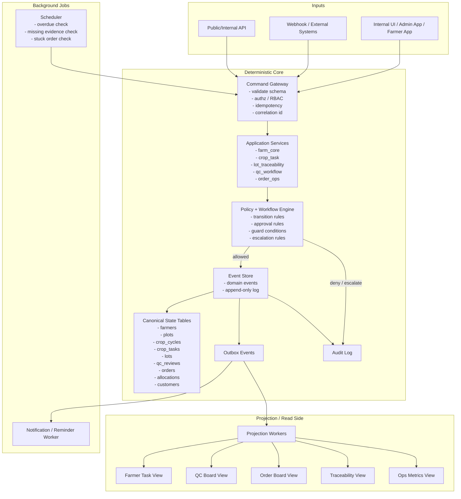

---

## 2) Generic write flow: command → policy → event → state → projection

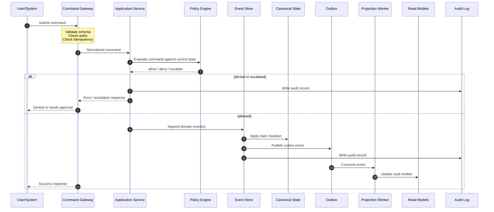

---

## 3) Crop Task logic flow

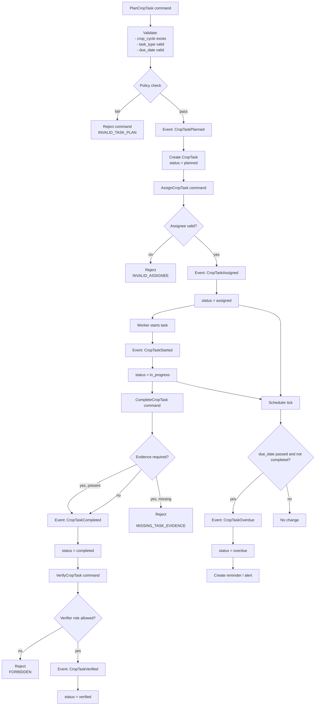

### State machine riêng cho Crop Task

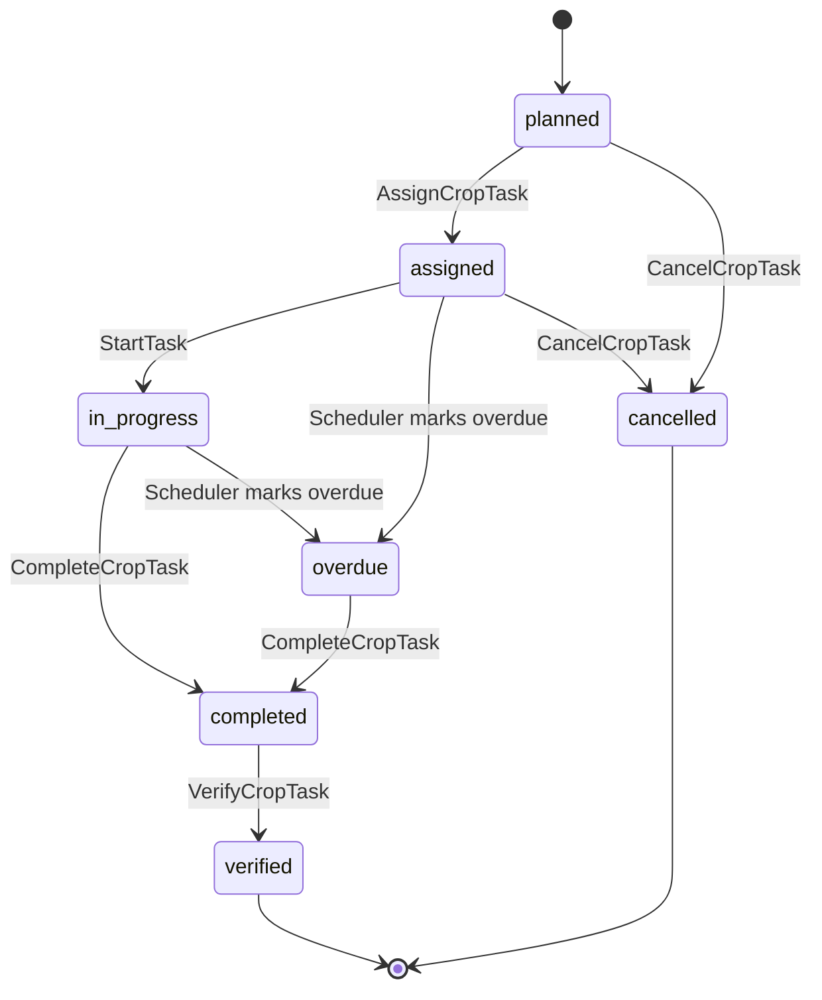

---

## 4) Lot + Traceability + QC logic flow

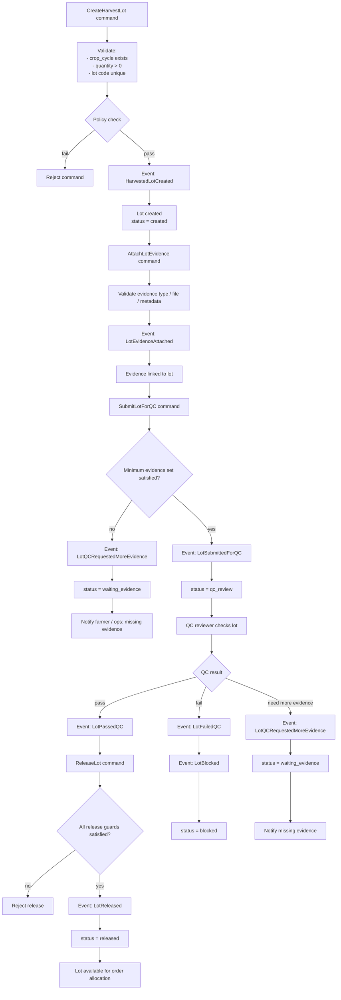

### State machine riêng cho Lot/QC

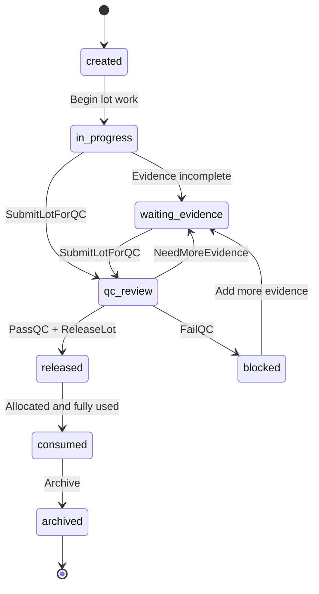

---

## 5) Order + Allocation + Cancel logic flow

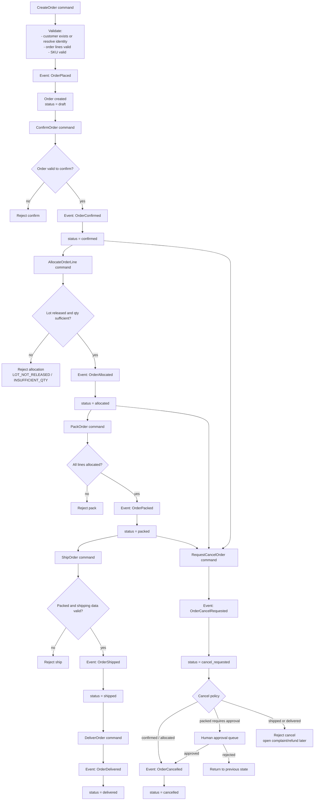

### State machine riêng cho Order

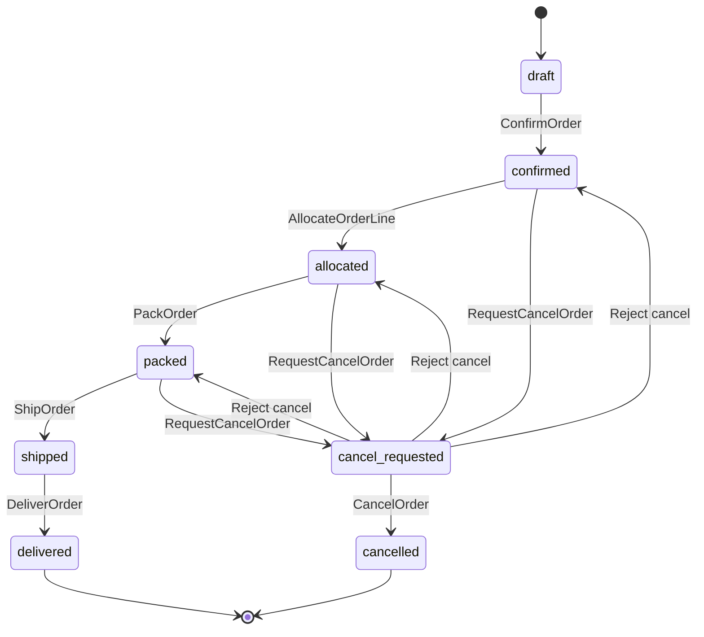

---

## 6) Scheduler / alerts / projections flow

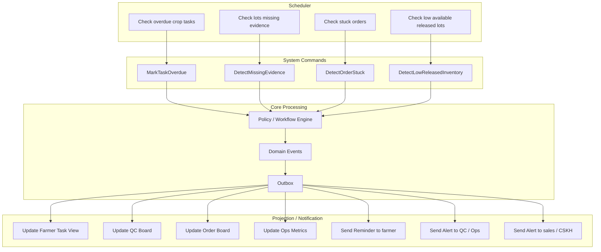

---

## 7) SSoT + Read Models flow

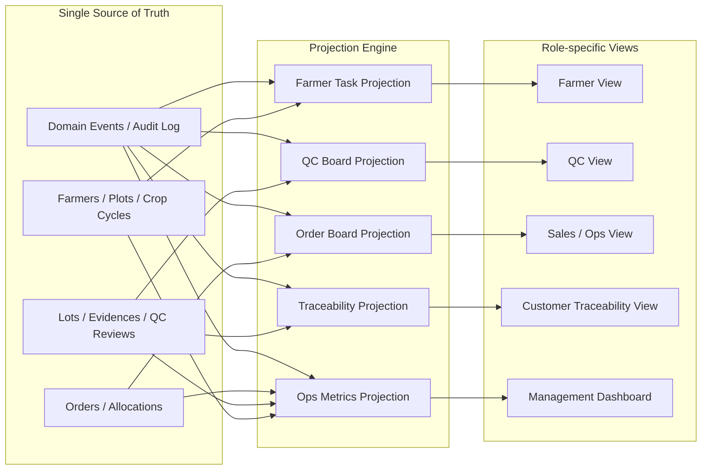

---

## 8) Chỗ để gắn AI sau này, nhưng không phá core

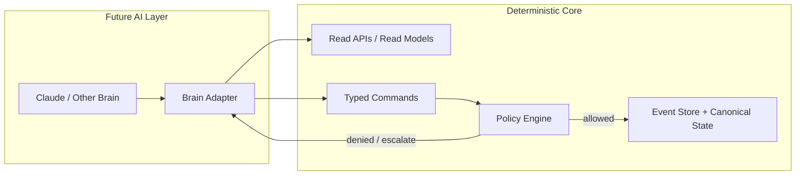

Ý nghĩa của sơ đồ này là:
**AI chỉ được đọc state và đề xuất/gọi command. Core vẫn là nơi quyết định thật.**

---

Nếu cậu muốn, tin nhắn tiếp theo tớ sẽ vẽ tiếp bộ **Mermaid cho từng module riêng** theo style còn chi tiết hơn nữa:

* `identity`
* `farm_core`
* `crop_task`
* `lot_traceability`
* `qc_workflow`
* `order_ops`
* `eventing_audit`
* `projections`
