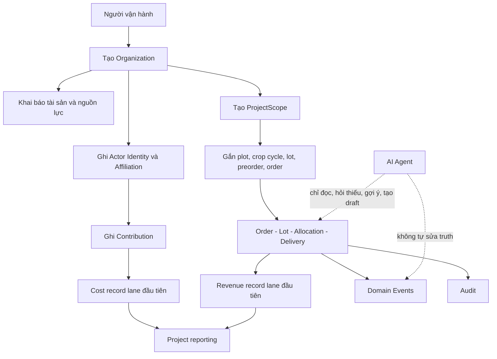

# Diagram: Nền Tảng Mở Từ Organization Đến Delivery

```mermaid
flowchart TD
    A[Người vận hành] --> B[Tạo Organization]
    B --> C[Khai báo tài sản và nguồn lực]
    B --> D[Tạo ProjectScope]
    D --> E[Gắn plot, crop cycle, lot, preorder, order]
    B --> F[Ghi Actor Identity và Affiliation]
    F --> G[Ghi Contribution]
    E --> H[Order - Lot - Allocation - Delivery]
    G --> I[Cost record lane đầu tiên]
    H --> J[Revenue record lane đầu tiên]
    I --> K[Project reporting]
    J --> K
    H --> L[Domain Events]
    H --> M[Audit]
    N[AI Agent] -. chỉ đọc, hỏi thiếu, gợi ý, tạo draft .-> H
    N -. không tự sửa truth .-> L
```