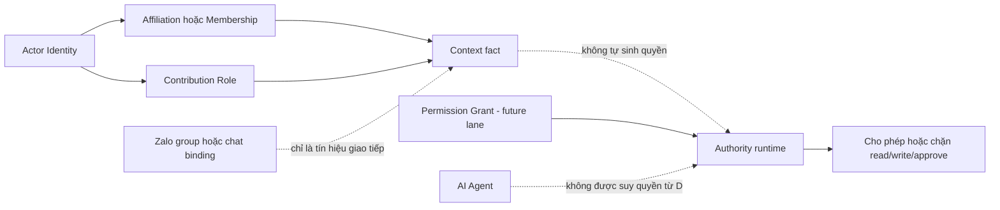

# Diagram: Context Fact Khác Authority Fact

```mermaid
flowchart LR
    A[Actor Identity] --> B[Affiliation hoặc Membership]
    A --> C[Contribution Role]
    B --> D[Context fact]
    C --> D
    D -. không tự sinh quyền .-> E[Authority runtime]
    F[Permission Grant - future lane] --> E
    E --> G[Cho phép hoặc chặn read/write/approve]
    H[Zalo group hoặc chat binding] -. chỉ là tín hiệu giao tiếp .-> D
    I[AI Agent] -. không được suy quyền từ D .-> E
```