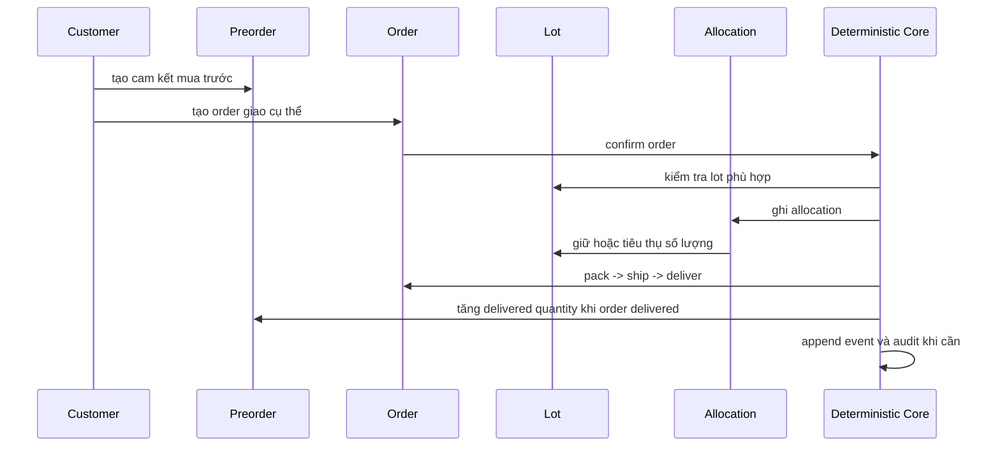

# Diagram: Current Runtime Order - Lot - Inventory

```mermaid
sequenceDiagram
    participant Customer as Customer
    participant Preorder as Preorder
    participant Order as Order
    participant Lot as Lot
    participant Allocation as Allocation
    participant Core as Deterministic Core

    Customer->>Preorder: tạo cam kết mua trước
    Customer->>Order: tạo order giao cụ thể
    Order->>Core: confirm order
    Core->>Lot: kiểm tra lot phù hợp
    Core->>Allocation: ghi allocation
    Allocation->>Lot: giữ hoặc tiêu thụ số lượng
    Core->>Order: pack -> ship -> deliver
    Core->>Preorder: tăng delivered quantity khi order delivered
    Core->>Core: append event và audit khi cần
```