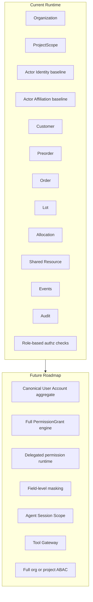

# Diagram: Current Runtime Và Future Roadmap

```mermaid
flowchart TB
    subgraph CurrentRuntime[Current Runtime]
        A[Organization]
        B[ProjectScope]
        C[Actor Identity baseline]
        D[Actor Affiliation baseline]
        E[Customer]
        F[Preorder]
        G[Order]
        H[Lot]
        I[Allocation]
        J[Shared Resource]
        K[Events]
        L[Audit]
        M[Role-based authz checks]
    end

    subgraph FutureRoadmap[Future Roadmap]
        N[Canonical User Account aggregate]
        O[Full PermissionGrant engine]
        P[Delegated permission runtime]
        Q[Field-level masking]
        R[Agent Session Scope]
        S[Tool Gateway]
        T[Full org or project ABAC]
    end

    CurrentRuntime --> FutureRoadmap
```