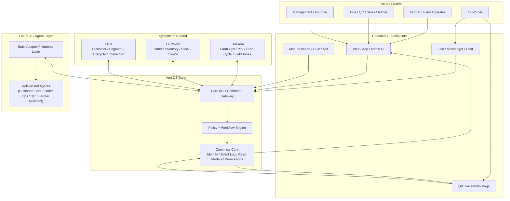

# 01. System Context Diagram

## Mục đích
Sơ đồ này mô tả bức tranh lớn của hệ thống: các hệ nghiệp vụ hiện có, Agri OS Core, người dùng chính, các kênh vào/ra, và lớp AI/harness trong tương lai.

## Mermaid

