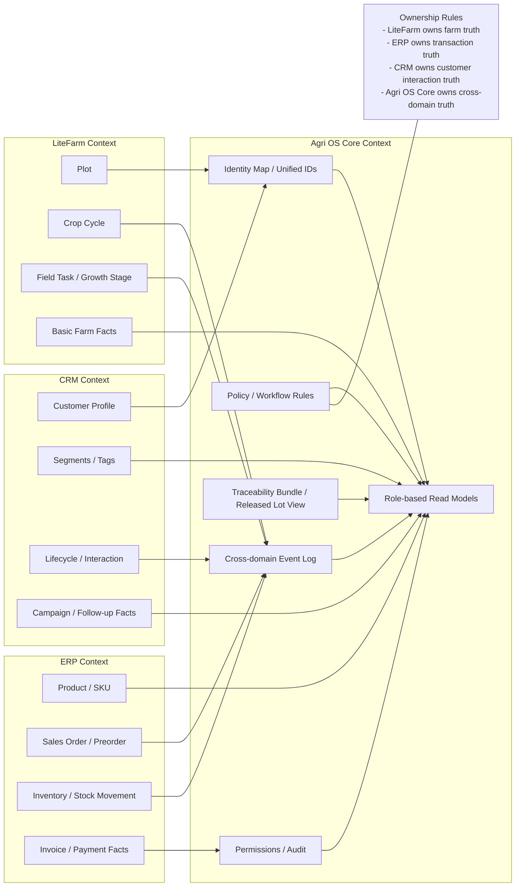

# 02. Domain Ownership / Context Map

## Mục đích
Sơ đồ này chốt rõ hệ nào là **source of truth** cho từng domain và Agri OS Core giữ phần liên thông nào.

> **Phân biệt Phase:**
> - Sơ đồ này mô tả **kiến trúc integration target** (khi LiteFarm, ERP, CRM đã kết nối).
> - **Phase 1 thực tế:** Agri OS Core quản lý trực tiếp CustomerProfile, Preorder, SalesOrder, Plot, CropCycle — không phụ thuộc vào ERP/CRM/LiteFarm làm source of truth.
> - Khi integration được activate (Phase 2+), ownership mới shift về đúng hệ sở hữu như diagram mô tả.
> - ADR-009: Core luôn giữ plot/crop **summary**; LiteFarm giữ deep field data (chi tiết canh tác, sensory data).

## Mermaid

