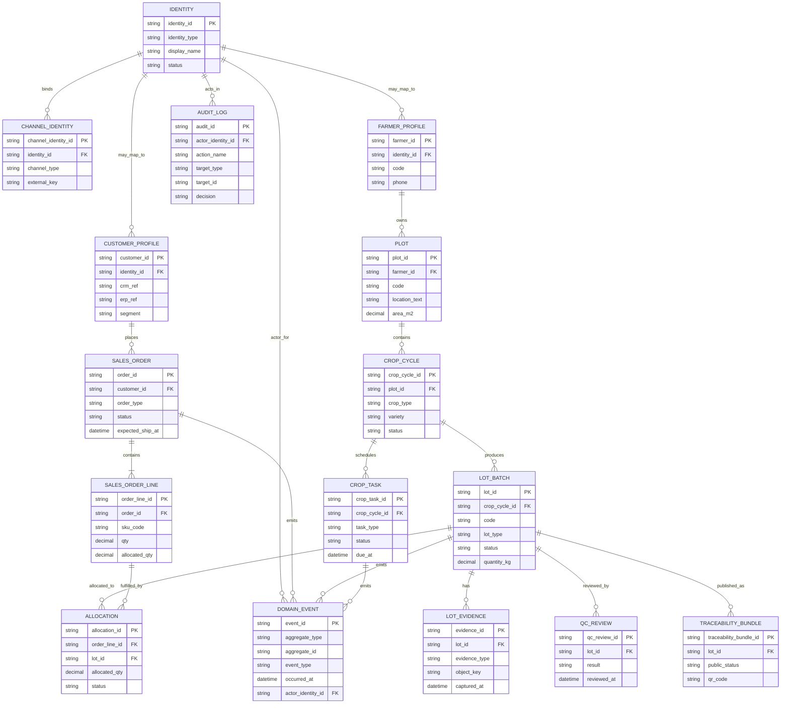

# 03. Canonical Data Model / ERD

## Mục đích
ERD này mô tả các thực thể canonical mà Agri OS Core cần giữ để liên thông các hệ.

## Mermaid

```mermaid
erDiagram
    IDENTITY ||--o{ CHANNEL_IDENTITY : binds
    IDENTITY ||--o{ CUSTOMER_PROFILE : may_map_to
    IDENTITY ||--o{ FARMER_PROFILE : may_map_to

    FARMER_PROFILE ||--o{ PLOT : owns
    PLOT ||--o{ CROP_CYCLE : contains
    CROP_CYCLE ||--o{ CROP_TASK : schedules
    CROP_CYCLE ||--o{ LOT_BATCH : produces

    LOT_BATCH ||--o{ LOT_EVIDENCE : has
    LOT_BATCH ||--o{ QC_REVIEW : reviewed_by
    LOT_BATCH ||--o{ ALLOCATION : allocated_to
    LOT_BATCH ||--o{ TRACEABILITY_BUNDLE : published_as

    CUSTOMER_PROFILE ||--o{ SALES_ORDER : places
    SALES_ORDER ||--|{ SALES_ORDER_LINE : contains
    SALES_ORDER_LINE ||--o{ ALLOCATION : fulfilled_by

    IDENTITY ||--o{ DOMAIN_EVENT : actor_for
    SALES_ORDER ||--o{ DOMAIN_EVENT : emits
    LOT_BATCH ||--o{ DOMAIN_EVENT : emits
    CROP_TASK ||--o{ DOMAIN_EVENT : emits

    IDENTITY ||--o{ AUDIT_LOG : acts_in

    IDENTITY {
      string identity_id PK
      string identity_type
      string display_name
      string status
    }
    CHANNEL_IDENTITY {
      string channel_identity_id PK
      string identity_id FK
      string channel_type
      string external_key
    }
    FARMER_PROFILE {
      string farmer_id PK
      string identity_id FK
      string code
      string phone
    }
    CUSTOMER_PROFILE {
      string customer_id PK
      string identity_id FK
      string crm_ref
      string erp_ref
      string segment
    }
    PLOT {
      string plot_id PK
      string farmer_id FK
      string code
      string location_text
      decimal area_m2
    }
    CROP_CYCLE {
      string crop_cycle_id PK
      string plot_id FK
      string crop_type
      string variety
      string status
    }
    CROP_TASK {
      string crop_task_id PK
      string crop_cycle_id FK
      string task_type
      string status
      datetime due_at
    }
    LOT_BATCH {
      string lot_id PK
      string crop_cycle_id FK
      string code
      string lot_type
      string status
      decimal quantity_kg
    }
    LOT_EVIDENCE {
      string evidence_id PK
      string lot_id FK
      string evidence_type
      string object_key
      datetime captured_at
    }
    QC_REVIEW {
      string qc_review_id PK
      string lot_id FK
      string result
      datetime reviewed_at
    }
    SALES_ORDER {
      string order_id PK
      string customer_id FK
      string order_type
      string status
      datetime expected_ship_at
    }
    SALES_ORDER_LINE {
      string order_line_id PK
      string order_id FK
      string sku_code
      decimal qty
      decimal allocated_qty
    }
    ALLOCATION {
      string allocation_id PK
      string order_line_id FK
      string lot_id FK
      decimal allocated_qty
      string status
    }
    TRACEABILITY_BUNDLE {
      string traceability_bundle_id PK
      string lot_id FK
      string public_status
      string qr_code
    }
    DOMAIN_EVENT {
      string event_id PK
      string aggregate_type
      string aggregate_id
      string event_type
      datetime occurred_at
      string actor_identity_id FK
    }
    AUDIT_LOG {
      string audit_id PK
      string actor_identity_id FK
      string action_name
      string target_type
      string target_id
      string decision
    }
```
