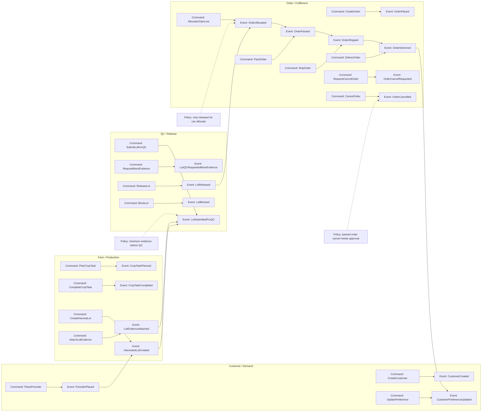

# 04. Event Storming / Event Map

## Mục đích
Sơ đồ này mô tả các event mốc của chuỗi giá trị và các command/policy chính liên quan.

## Mermaid

```mermaid
flowchart LR
    subgraph CustomerDomain["Customer / Demand"]
        C0["Command: CreateCustomer"] --> E0["Event: CustomerCreated"]
        C1["Command: PlacePreorder"] --> E1["Event: PreorderPlaced"]
        C2["Command: UpdatePreference"] --> E2["Event: CustomerPreferenceUpdated"]
    end

    subgraph FarmDomain["Farm / Production"]
        F0["Command: PlanCropTask"] --> F1["Event: CropTaskPlanned"]
        F2["Command: CompleteCropTask"] --> F3["Event: CropTaskCompleted"]
        F4["Command: CreateHarvestLot"] --> F5["Event: HarvestedLotCreated"]
        F6["Command: AttachLotEvidence"] --> F7["Event: LotEvidenceAttached"]
    end

    subgraph QCDomain["QC / Release"]
        Q0["Command: SubmitLotForQC"] --> Q1["Event: LotSubmittedForQC"]
        Q2["Command: RequestMoreEvidence"] --> Q3["Event: LotQCRequestedMoreEvidence"]
        Q4["Command: ReleaseLot"] --> Q5["Event: LotReleased"]
        Q6["Command: BlockLot"] --> Q7["Event: LotBlocked"]
    end

    subgraph OrderDomain["Order / Fulfillment"]
        O0["Command: CreateOrder"] --> O1["Event: OrderPlaced"]
        O2["Command: AllocateOrderLine"] --> O3["Event: OrderAllocated"]
        O4["Command: PackOrder"] --> O5["Event: OrderPacked"]
        O6["Command: ShipOrder"] --> O7["Event: OrderShipped"]
        O8["Command: DeliverOrder"] --> O9["Event: OrderDelivered"]
        O10["Command: RequestCancelOrder"] --> O11["Event: OrderCancelRequested"]
        O12["Command: CancelOrder"] --> O13["Event: OrderCancelled"]
    end

    E1 --> F5
    F5 --> Q1
    F7 --> Q1
    Q5 --> O3
    O3 --> O5
    O5 --> O7
    O7 --> O9
    O9 --> E2

    P1["Policy: only released lot can allocate"] -.-> O3
    P2["Policy: packed order cancel needs approval"] -.-> O13
    P3["Policy: minimum evidence before QC"] -.-> Q1
```
