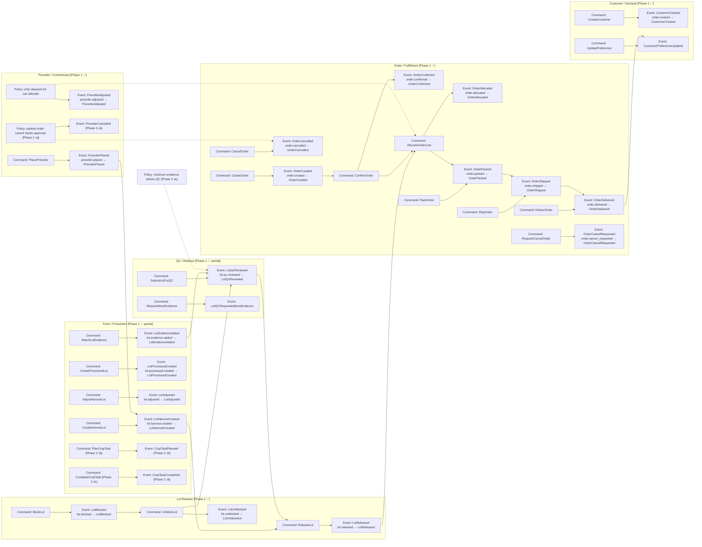

# 04. Event Storming / Event Map

## Mục đích
Sơ đồ này mô tả các event mốc của chuỗi giá trị và các command/policy chính liên quan.

> **Phạm vi:**
> - `[Phase 1 ✅]` = event đang được emit trong `agos_app/app/services/`
> - `[Phase 2 🔜]` = event đã thiết kế nhưng chưa implement
>
> **Tên event:** dùng PascalCase (class style) trong diagram. Runtime style là dotted lowercase.
> Xem mapping đầy đủ tại `docs/changelog/v1/architecture/05-event-catalog.md`.

## Mermaid

## Event Name Reference (Phase 1)

| Command | Event (PascalCase) | Runtime name (dotted) |
|---|---|---|
| CreateCustomer | CustomerCreated | `customer.created` |
| UpdatePreference | CustomerPreferenceUpdated | `customer.preference_updated` |
| PlacePreorder | PreorderPlaced | `preorder.placed` |
| AdjustPreorder | PreorderAdjusted | `preorder.adjusted` |
| CreateHarvestLot | LotHarvestCreated | `lot.harvest.created` |
| CreateProcessedLot | LotProcessedCreated | `lot.processed.created` |
| AdjustHarvestLot | LotAdjusted | `lot.adjusted` |
| AttachLotEvidence | LotEvidenceAdded | `lot.evidence.added` |
| SubmitLotForQC | LotQcReviewed | `lot.qc.reviewed` |
| ReleaseLot | LotReleased | `lot.released` |
| BlockLot | LotBlocked | `lot.blocked` |
| UnblockLot | LotUnblocked | `lot.unblocked` |
| CreateOrder | OrderCreated | `order.created` |
| ConfirmOrder | OrderConfirmed | `order.confirmed` |
| AllocateOrderLine | OrderAllocated | `order.allocated` |
| PackOrder | OrderPacked | `order.packed` |
| ShipOrder | OrderShipped | `order.shipped` |
| DeliverOrder | OrderDelivered | `order.delivered` |
| RequestCancelOrder | OrderCancelRequested | `order.cancel_requested` |
| CancelOrder | OrderCancelled | `order.cancelled` |
