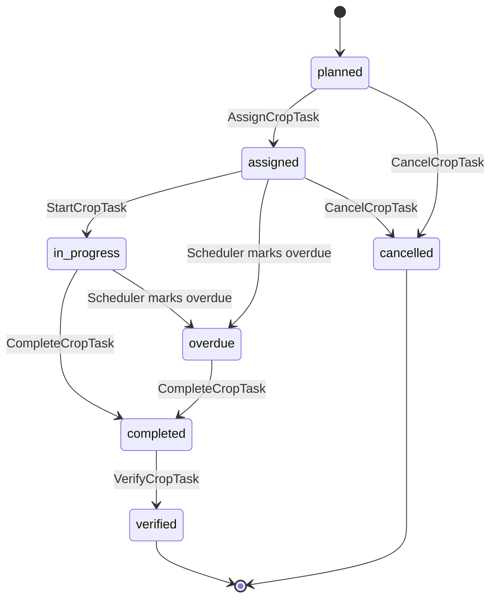
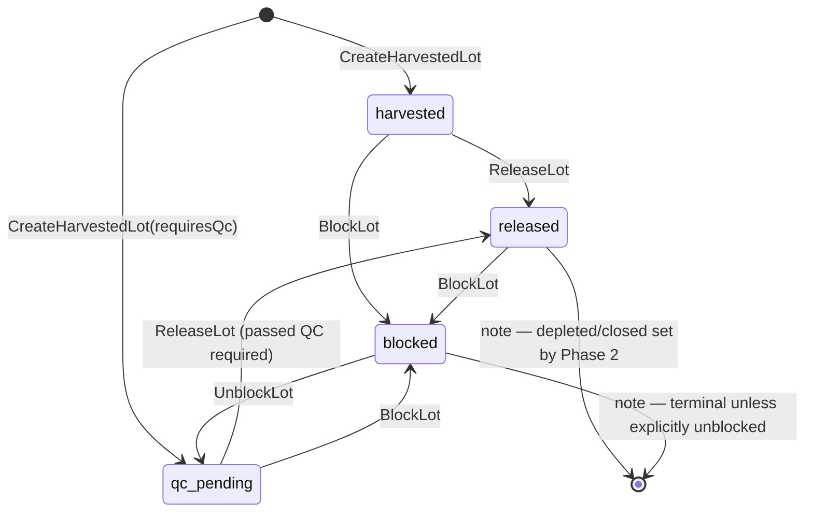
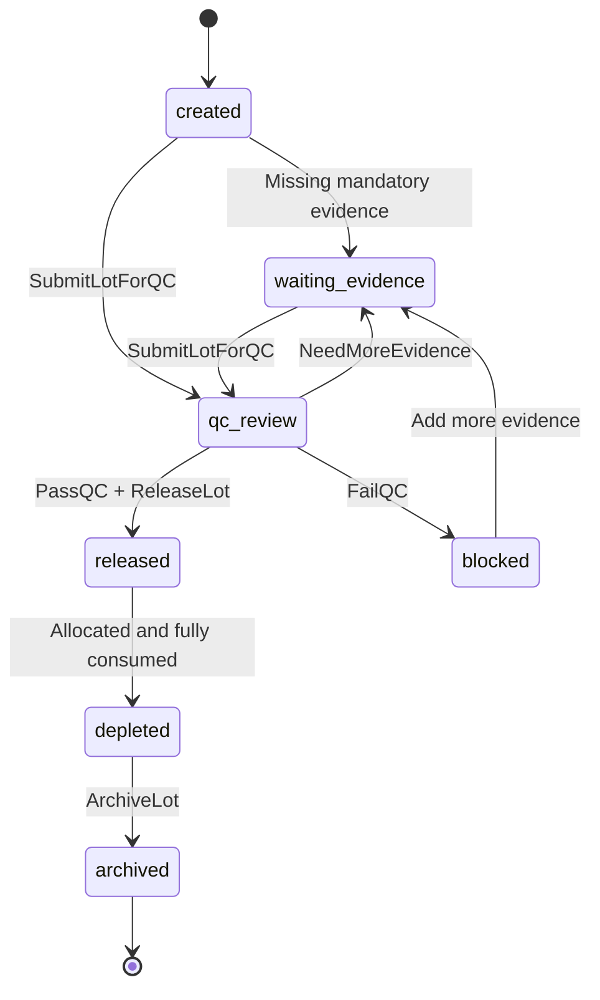
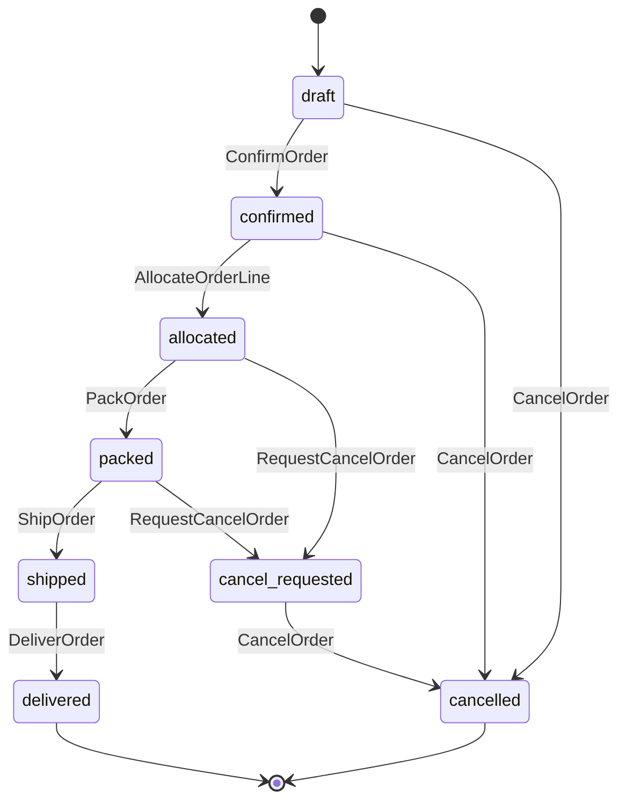
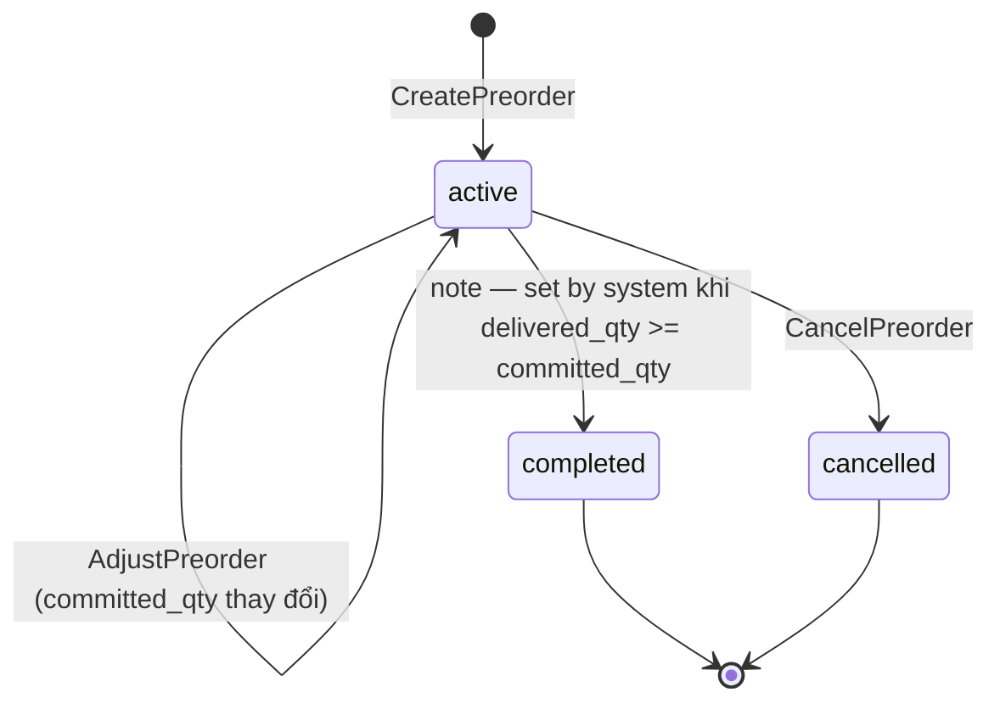
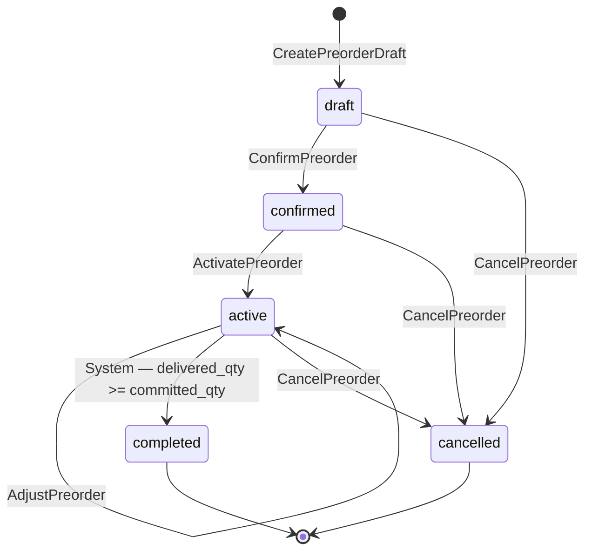

# 05. State Machines: CropTask, Lot, Order, Preorder

> **Đọc trước khi dùng diagram này:**
> - `[Phase 1 ✅]` = đã implement trong `agos_app/app/core/gateway.py`
> - `[Phase 2 🔜]` = có trong enum / architecture docs nhưng chưa enforce trong gateway
> - Tất cả transition được lấy trực tiếp từ `gateway.py::ORDER_TRANSITIONS`, `LOT_TRANSITIONS`, `PREORDER_TRANSITIONS`

---

## 5.1 CropTask State Machine `[Phase 2 🔜]`

> **Lưu ý Phase 1:** Farm module hiện là **read-only**. Gateway chưa enforce CropTask transitions.
> State machine này mô tả intent cho Phase 2 khi farm operations được activate.

---

## 5.2 Lot State Machine

### 5.2a Phase 1 — Implemented `[Phase 1 ✅]`

> Source: `gateway.py::LOT_TRANSITIONS`
> Lots được tạo trực tiếp ở trạng thái `harvested`. QC workflow đầy đủ bị defer sang Phase 2.

### 5.2b Phase 2 — Planned `[Phase 2 🔜]`

> Full QC workflow với evidence và review. Chưa có trong gateway Phase 1.

---

## 5.3 Order State Machine `[Phase 1 ✅]`

> Source: `gateway.py::ORDER_TRANSITIONS`
>
> **Điểm khác so với diagram cũ:**
> - `draft` có thể cancel trực tiếp → `cancelled` (đã có trong code)
> - `confirmed` có thể cancel trực tiếp → `cancelled` (không qua `cancel_requested`)
> - `RejectCancel` transition (cancel_requested → confirmed/allocated/packed) **chưa implement** [Phase 2 🔜]

---

## 5.4 Preorder State Machine `[Phase 1 ✅ / Phase 1.5 🔜]`

> Source: `gateway.py::PREORDER_TRANSITIONS`
>
> **Phase 1:** Preorder được tạo trực tiếp ở trạng thái `active`. `adjust` giữ nguyên state.
> **Phase 1.5 (planned):** Full lifecycle `draft → confirmed → active → completed`.

### 5.4a Phase 1 — Implemented `[Phase 1 ✅]`

### 5.4b Phase 1.5 — Planned `[Phase 1.5 🔜]`

> Full preorder lifecycle với approval flow. `draft` và `confirmed` states tồn tại trong enum
> nhưng gateway chưa enforce.

