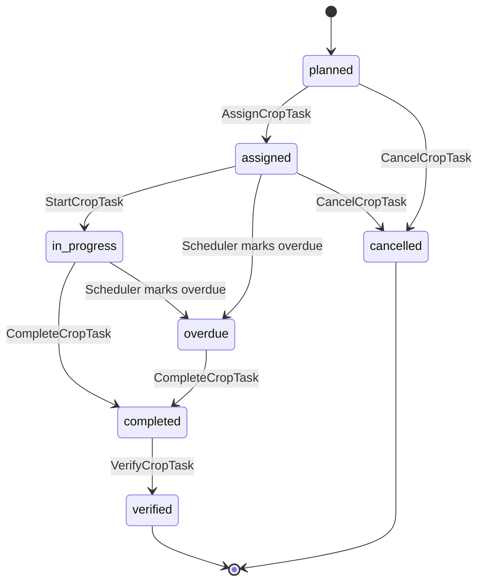
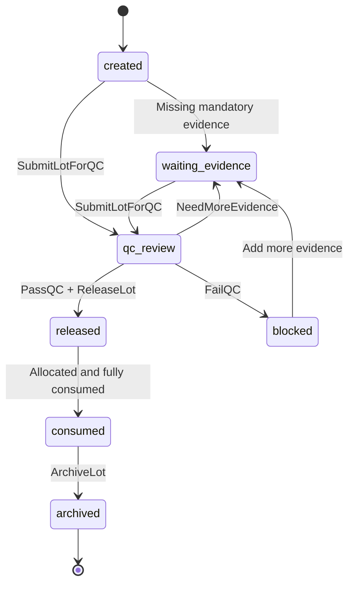
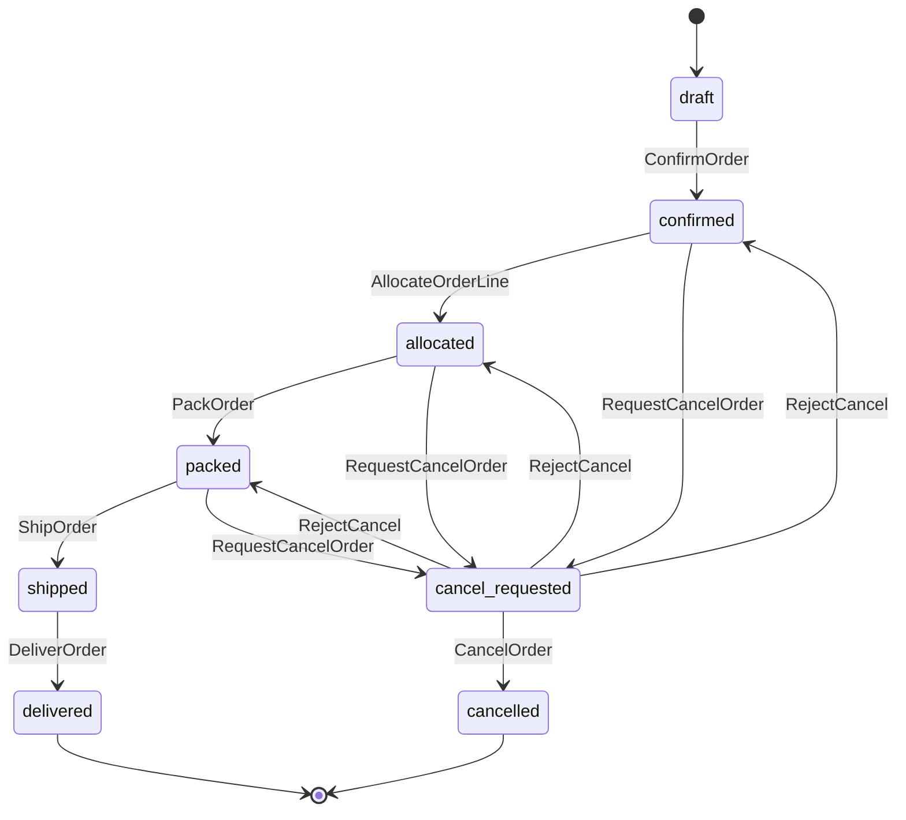

# 05. State Machines: CropTask, Lot, Order

## 5.1 CropTask State Machine

```mermaid
stateDiagram-v2
    [*] --> planned
    planned --> assigned: AssignCropTask
    planned --> cancelled: CancelCropTask
    assigned --> in_progress: StartCropTask
    assigned --> overdue: Scheduler marks overdue
    assigned --> cancelled: CancelCropTask
    in_progress --> completed: CompleteCropTask
    in_progress --> overdue: Scheduler marks overdue
    overdue --> completed: CompleteCropTask
    completed --> verified: VerifyCropTask
    verified --> [*]
    cancelled --> [*]
```

## 5.2 Lot / QC State Machine

```mermaid
stateDiagram-v2
    [*] --> created
    created --> waiting_evidence: Missing mandatory evidence
    created --> qc_review: SubmitLotForQC
    waiting_evidence --> qc_review: SubmitLotForQC
    qc_review --> released: PassQC + ReleaseLot
    qc_review --> blocked: FailQC
    qc_review --> waiting_evidence: NeedMoreEvidence
    blocked --> waiting_evidence: Add more evidence
    released --> consumed: Allocated and fully consumed
    consumed --> archived: ArchiveLot
    archived --> [*]
```

## 5.3 Order State Machine

```mermaid
stateDiagram-v2
    [*] --> draft
    draft --> confirmed: ConfirmOrder
    confirmed --> allocated: AllocateOrderLine
    allocated --> packed: PackOrder
    packed --> shipped: ShipOrder
    shipped --> delivered: DeliverOrder

    confirmed --> cancel_requested: RequestCancelOrder
    allocated --> cancel_requested: RequestCancelOrder
    packed --> cancel_requested: RequestCancelOrder

    cancel_requested --> cancelled: CancelOrder
    cancel_requested --> confirmed: RejectCancel
    cancel_requested --> allocated: RejectCancel
    cancel_requested --> packed: RejectCancel

    delivered --> [*]
    cancelled --> [*]
```
