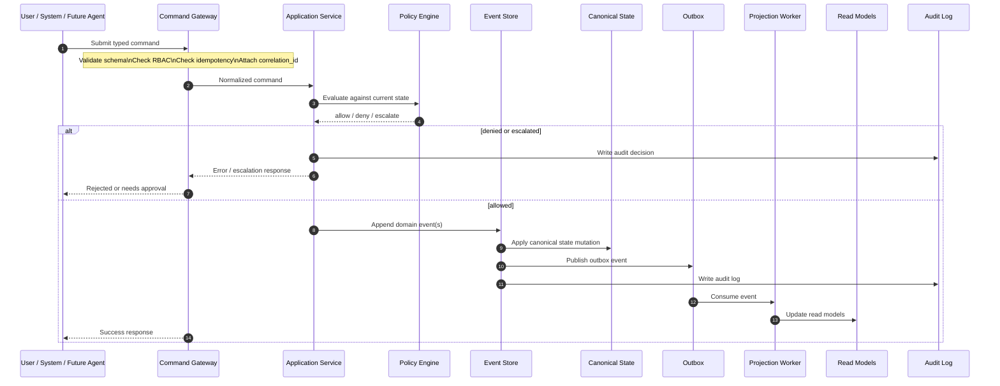

# 06. Command → Policy → Event → Projection Flow

## Mục đích
Đây là flow write chuẩn của Agri OS Core: mọi thay đổi trạng thái đều đi theo một đường chung.

## Mermaid

```mermaid
sequenceDiagram
    autonumber
    participant U as User / System / Future Agent
    participant CG as Command Gateway
    participant APP as Application Service
    participant POL as Policy Engine
    participant EVT as Event Store
    participant ST as Canonical State
    participant OB as Outbox
    participant PR as Projection Worker
    participant RM as Read Models
    participant AU as Audit Log

    U->>CG: Submit typed command
    Note over CG: Validate schema\nCheck RBAC\nCheck idempotency\nAttach correlation_id
    CG->>APP: Normalized command
    APP->>POL: Evaluate against current state
    POL-->>APP: allow / deny / escalate

    alt denied or escalated
        APP->>AU: Write audit decision
        APP-->>CG: Error / escalation response
        CG-->>U: Rejected or needs approval
    else allowed
        APP->>EVT: Append domain event(s)
        EVT->>ST: Apply canonical state mutation
        EVT->>OB: Publish outbox event
        EVT->>AU: Write audit log
        OB->>PR: Consume event
        PR->>RM: Update read models
        CG-->>U: Success response
    end
```
