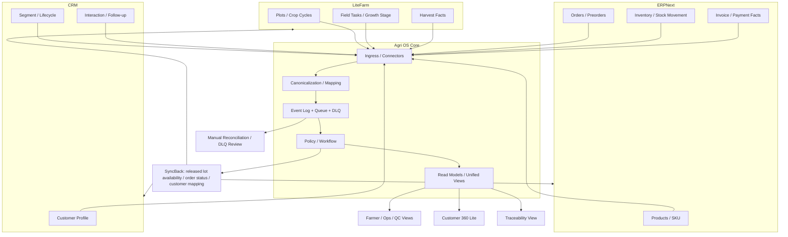

# 07. Integration Flow: LiteFarm / ERP / CRM ↔ Core

## Mục đích
Sơ đồ này mô tả hướng sync dữ liệu giữa 3 hệ nghiệp vụ và Agri OS Core.

## Mermaid

```mermaid
flowchart TB
    subgraph LiteFarm["LiteFarm"]
        LF1["Plots / Crop Cycles"]
        LF2["Field Tasks / Growth Stage"]
        LF3["Harvest Facts"]
    end

    subgraph ERP["ERPNext"]
        ERP1["Products / SKU"]
        ERP2["Orders / Preorders"]
        ERP3["Inventory / Stock Movement"]
        ERP4["Invoice / Payment Facts"]
    end

    subgraph CRM["CRM"]
        CRM1["Customer Profile"]
        CRM2["Segment / Lifecycle"]
        CRM3["Interaction / Follow-up"]
    end

    subgraph Core["Agri OS Core"]
        IN["Ingress / Connectors"]
        CAN["Canonicalization / Mapping"]
        EVQ["Event Log + Queue + DLQ"]
        POL["Policy / Workflow"]
        RM["Read Models / Unified Views"]
    end

    LF1 --> IN
    LF2 --> IN
    LF3 --> IN
    ERP1 --> IN
    ERP2 --> IN
    ERP3 --> IN
    ERP4 --> IN
    CRM1 --> IN
    CRM2 --> IN
    CRM3 --> IN

    IN --> CAN --> EVQ --> POL --> RM

    RM --> OUT1["Farmer / Ops / QC Views"]
    RM --> OUT2["Customer 360 Lite"]
    RM --> OUT3["Traceability View"]

    POL --> SyncBack1["SyncBack: released lot availability / order status / customer mapping"]
    SyncBack1 --> LiteFarm
    SyncBack1 --> ERP
    SyncBack1 --> CRM

    DLQ["Manual Reconciliation / DLQ Review"]
    EVQ --> DLQ
```
