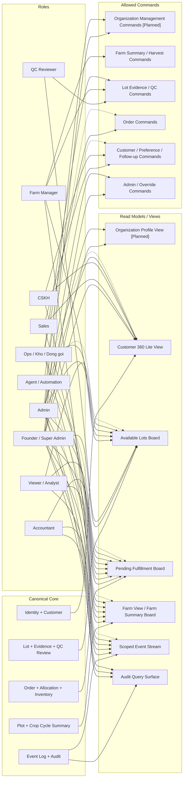

# 08. Role-based View / Permission Diagram

## Mục đích
Sơ đồ này thể hiện nguyên tắc **one truth, many views**: cùng một dữ liệu gốc, mỗi role nhìn khác nhau và được thực hiện command khác nhau.

> **Phase 1 API endpoints** (role-facing read surfaces + debug readback):
>
> | Endpoint | Conceptual View |
> |---|---|
> | `GET /api/v1/views/customer-360/{customer_id}` | Customer 360 Lite View |
> | `GET /api/v1/views/available-lots` | Available Lot Board — released lots chưa được allocate hết |
> | `GET /api/v1/views/pending-fulfillment` | Pending Fulfillment Board |
> | `GET /api/v1/views/farm` | Farm View — plots + active crop cycles |
> | `GET /api/v1/views/farm-summary-board` | Farm Summary Board |
> | `GET /api/v1/events` | Scoped Event Stream — short-term read lane cho operator / analyst use cases |
> | `GET /api/v1/audit` | Audit Query Surface — operator/debug readback, không phải role-facing business view |
>
> Các view còn lại (Farmer Task View, QC Board, Traceability, Management Metrics) là Phase 2.
>
> `GET /api/v1/events` là short-term scoped read lane; role enforcement chi tiết vẫn là phần rollout PR sau.
>
> `GET /api/v1/audit` là read-only query surface cho operator/debug ở Phase 1; current enforced readers là Founder / Super Admin, Admin, và Accountant. Các role khác bị deny và ghi audit `audit.query`.
>
> Raw customer reads ở Phase 1 cũng đi lane hẹp: `GET /api/v1/customers`, `GET /api/v1/customers/{customer_id}`, `GET /api/v1/customers/duplicate-candidates`, và `GET /api/v1/customers/{customer_id}/duplicate-candidates` hiện chỉ cho Founder / Super Admin / Admin / Sales / CSKH. Ops, Accountant, Viewer, và raw agent reads phải dùng customer-facing view/tool surface khác hoặc bị deny trên raw lane.
>
> Raw lot reads ở Phase 1 không mở rộng như read models: `GET /api/v1/lots/{lot_id}`, `GET /api/v1/lots/{lot_id}/evidence`, và `GET /api/v1/lots/{lot_id}/qc-reviews` hiện chỉ cho Founder / Super Admin / Admin / Ops / Farm Manager / QC Reviewer. Lot create, adjust, release, block, unblock dùng service-layer write authz; evidence add và QC review giữ lane riêng cho QC.
>
> `Organization` hiện mới được khóa ở architecture baseline, chưa có Phase 1 API/runtime. Khi slice Organization CRUD được mở, Founder / Super Admin và Admin sẽ là nhóm mutate chính; customer vẫn là shared ecosystem identity chứ không thành owned view của từng organization.

## Mermaid

## Phase 1 notes

- `qc_reviewer` là top-level business role riêng cho QC lane, không phải delegated capability của `ops` hay `farm_manager`.
- `viewer / analyst` short-term đi qua `/api/v1/views/*` và scoped `/api/v1/events`; không dùng raw operational reads theo mặc định.
- `agent / automation` vẫn advisory-first. Sơ đồ cho thấy nó có thể đọc hoặc tạo draft trong scope được cấp, nhưng không có bypass lane nào đang enable ở Phase 1.
- `Organization Profile View [Planned]` và `Organization Management Commands [Planned]` là docs-first baseline cho slice Organization; chúng không ngầm khẳng định runtime đã ship endpoint tương ứng.
