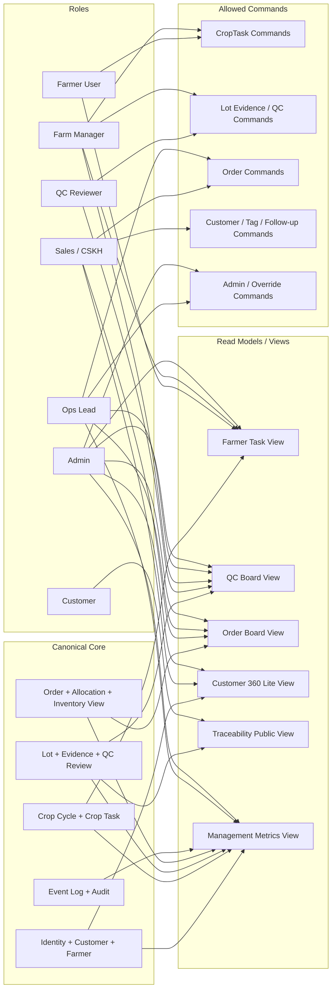

# 08. Role-based View / Permission Diagram

## Mục đích
Sơ đồ này thể hiện nguyên tắc **one truth, many views**: cùng một dữ liệu gốc, mỗi role nhìn khác nhau và được thực hiện command khác nhau.

> **Phase 1 API endpoints** (thực tế trong `agos_app/app/api/routes/views.py`):
>
> | Endpoint | Conceptual View |
> |---|---|
> | `GET /views/customer-360/{id}` | Customer 360 Lite View (V4) |
> | `GET /views/available-lots` | Available Lot Board — released lots chưa được allocate hết |
> | `GET /views/pending-fulfillment` | Order Board View (V3) — confirmed/allocated/packed orders |
> | `GET /views/farm` | Farm View — plots + active crop cycles |
>
> Các view còn lại (Farmer Task View, QC Board, Traceability, Management Metrics) là Phase 2.

## Mermaid

