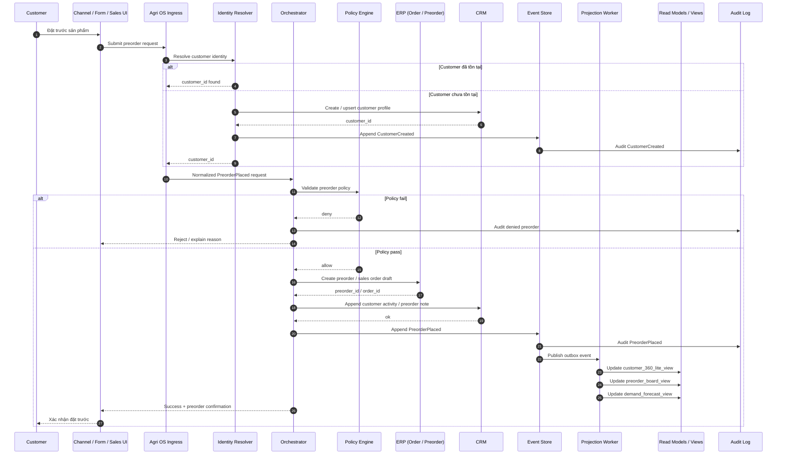

# Sequence Diagram — PreorderPlaced

Sơ đồ này mô tả luồng end-to-end khi khách hàng đặt trước sản phẩm.

Mục tiêu:
- tạo hoặc resolve đúng khách hàng
- ghi nhận preorder vào ERP/CRM theo đúng domain ownership
- ghi event chuẩn vào Agri OS Core
- cập nhật read models cho sales/ops/customer

