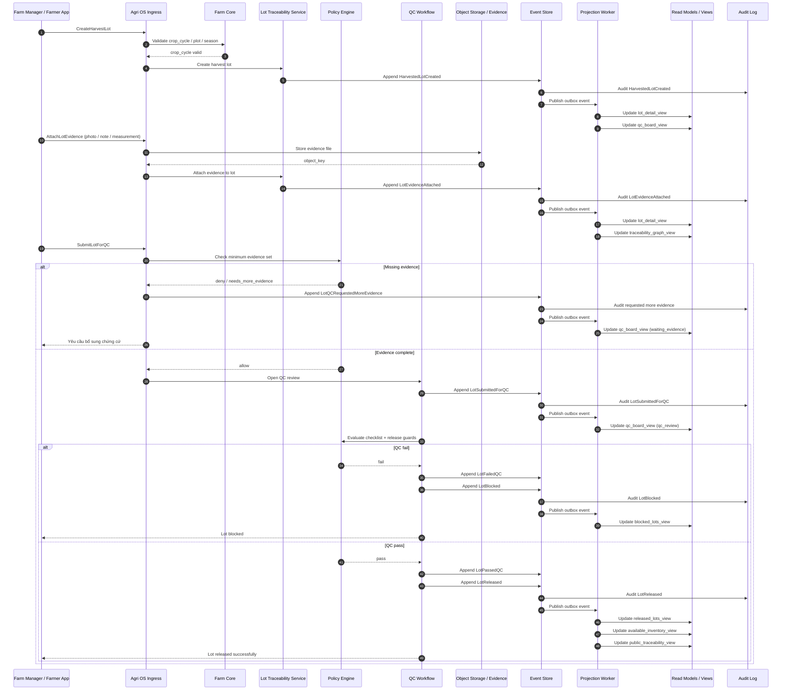

# Sequence Diagram — HarvestedLotCreated to LotReleased

Sơ đồ này mô tả luồng end-to-end từ lúc tạo lô thu hoạch đến lúc lô được release để có thể allocate cho đơn hàng.

Mục tiêu:
- tạo lô gắn đúng crop cycle / plot
- bổ sung chứng cứ truy xuất
- đi qua QC workflow
- chỉ release khi đủ điều kiện

