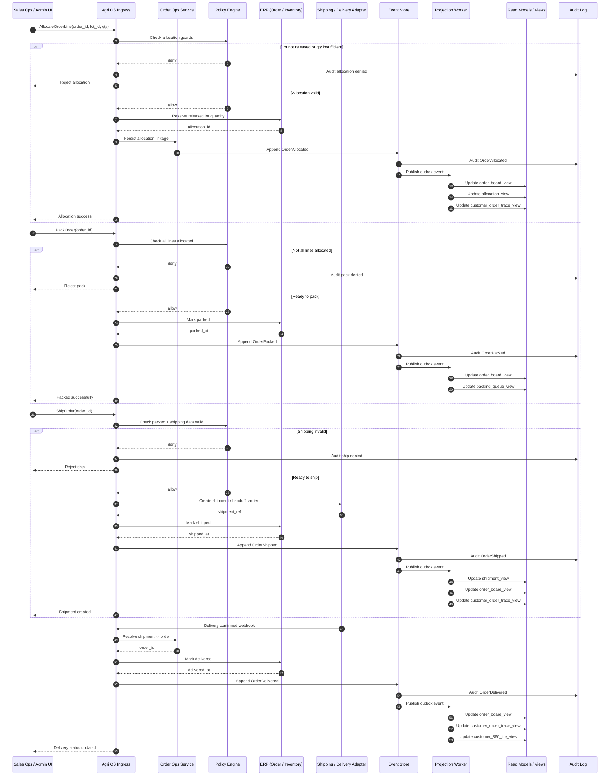

# Sequence Diagram — OrderAllocated to OrderDelivered

Sơ đồ này mô tả luồng end-to-end từ lúc đơn đã sẵn sàng allocate lô đến lúc giao hàng thành công.

Mục tiêu:
- chỉ allocate từ lot đã released
- reserve đúng số lượng
- đóng gói, giao hàng, cập nhật delivery
- nuôi read models cho sales/ops/customer

